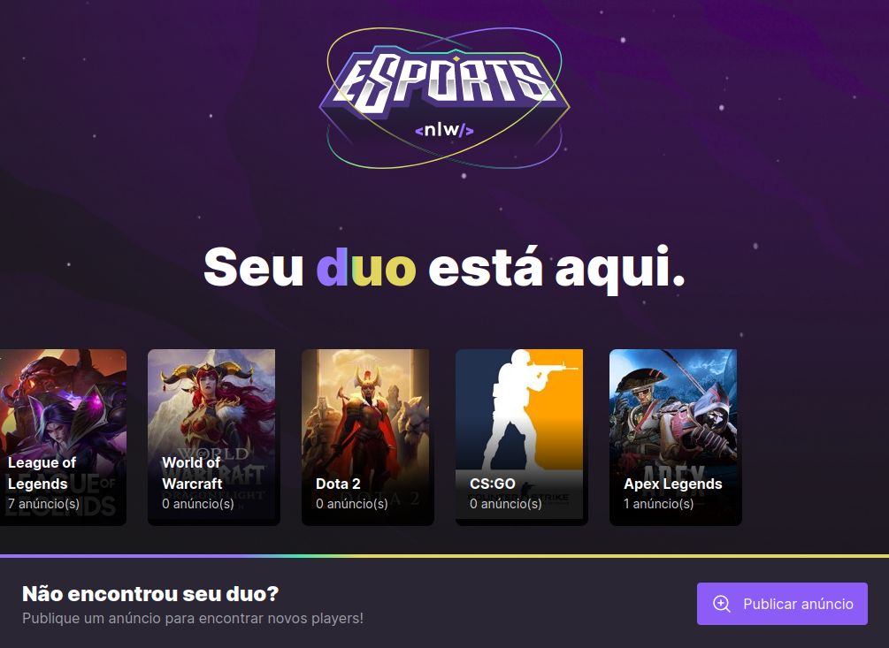
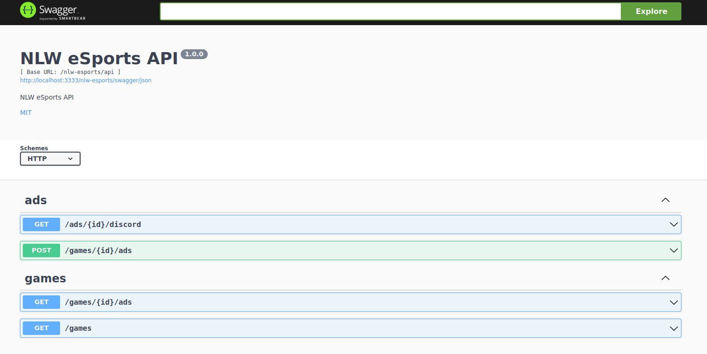

# nlw-esports
NLW eSports - Rocketseat





obs.: Server application is personalized

## Server diferences

* [Fastify framework](https://github.com/fastify/fastify)
* Dependencies injection with [awilix](https://github.com/jeffijoe/awilix)
* [Swagger](https://github.com/fastify/fastify-swagger) and [swagger-autogen](https://github.com/davibaltar/swagger-autogen)

## How to install

### Server

1. Install all dependencies
```sh
npm install
```
2. Create .env file
```env
PORT=3333
APP_ENV=LOCAL
CONTEXT_PATH=/nlw-esports
DATABASE_URL="file:../src/database/db.sqlite"
```

3. Generate swagger file
```sh
npm run swagger-autogen
```

4. Run application
```sh
npm run dev
```

### web

1. Install all dependencies and run
```sh
npm install
npm run dev
```
### mobile
1. Install all dependencies
```sh
npm install
```
2. Create .env file
```env
GAMES_API_URL=http://${my-server-ip}:3333/nlw-esports/api/
```

3. Run application
```sh
npm run start
```